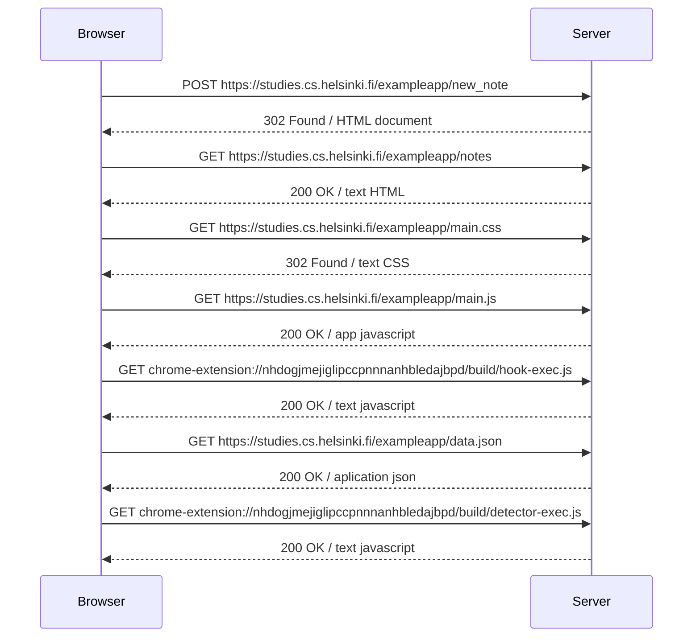

## Diagrama 0.4

```mermaid
sequenceDiagram
    Browser->>Server: POST https://studies.cs.helsinki.fi/exampleapp/new_note
    Server-->>Browser: 302 Found / HTML document 
    Browser->>Server: GET https://studies.cs.helsinki.fi/exampleapp/notes
    Server-->>Browser: 200 OK / text HTML
    Browser->>Server: GET https://studies.cs.helsinki.fi/exampleapp/main.css
    Server-->>Browser: 302 Found / text CSS 
    Browser->>Server: GET https://studies.cs.helsinki.fi/exampleapp/main.js
    Server-->>Browser: 200 OK / app javascript
    Browser->>Server: GET chrome-extension://nhdogjmejiglipccpnnnanhbledajbpd/build/hook-exec.js
    Server-->>Browser: 200 OK / text javascript
    Browser->>Server: GET https://studies.cs.helsinki.fi/exampleapp/data.json
    Server-->>Browser: 200 OK / aplication json
    Browser->>Server: GET chrome-extension://nhdogjmejiglipccpnnnanhbledajbpd/build/detector-exec.js
    Server-->>Browser: 200 OK / text javascript

```