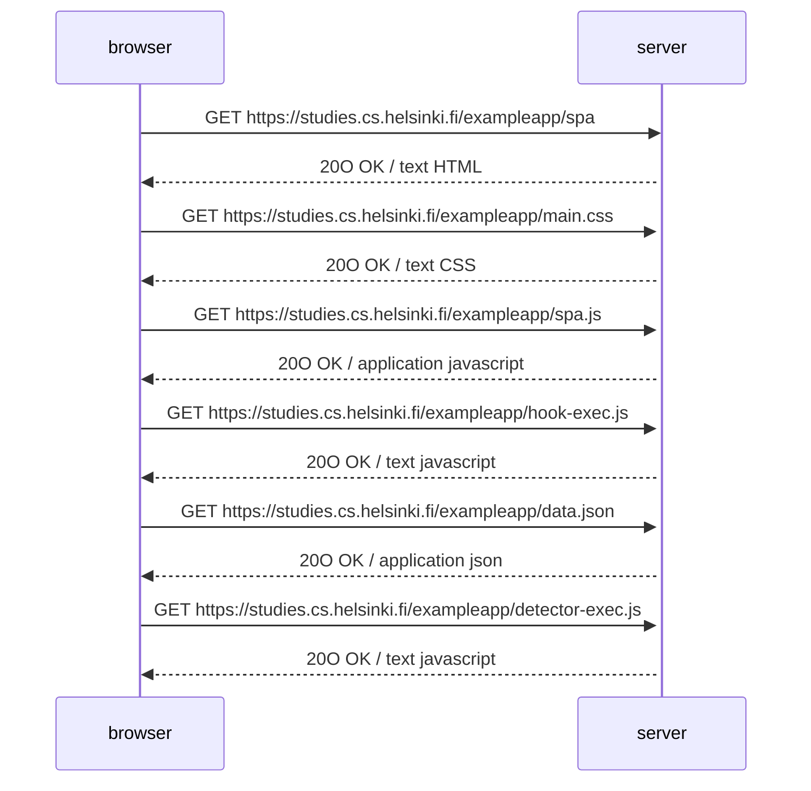

## Diagrama 0.5

```mermaid

sequenceDiagram
    browser->>server: GET https://studies.cs.helsinki.fi/exampleapp/spa
    activate server
    server-->>browser: 20O OK / text HTML
    
    browser->>server: GET https://studies.cs.helsinki.fi/exampleapp/main.css
    activate server
    server-->>browser: 20O OK / text CSS
    
    browser->>server: GET https://studies.cs.helsinki.fi/exampleapp/spa.js
    activate server
    server-->>browser: 20O OK / application javascript
    
    browser->>server: GET https://studies.cs.helsinki.fi/exampleapp/hook-exec.js
    activate server
    server-->>browser: 20O OK / text javascript
    
    browser->>server: GET https://studies.cs.helsinki.fi/exampleapp/data.json
    activate server
    server-->>browser: 20O OK / application json
    
    browser->>server: GET https://studies.cs.helsinki.fi/exampleapp/detector-exec.js
    activate server
    server-->>browser: 20O OK / text javascript
```